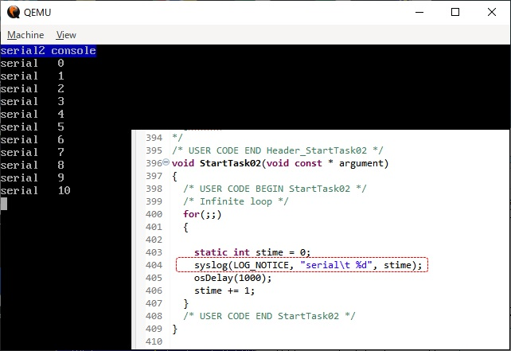
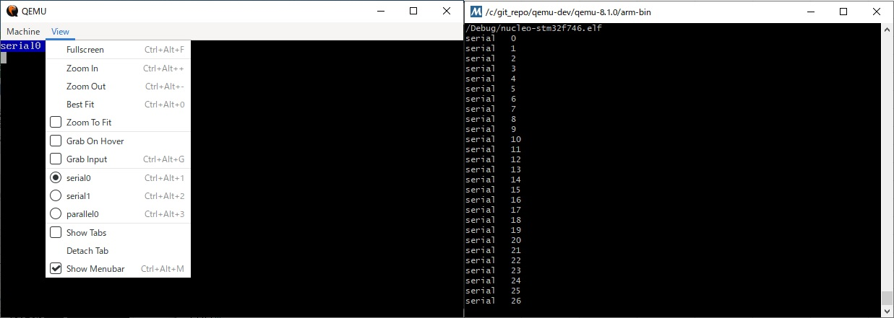
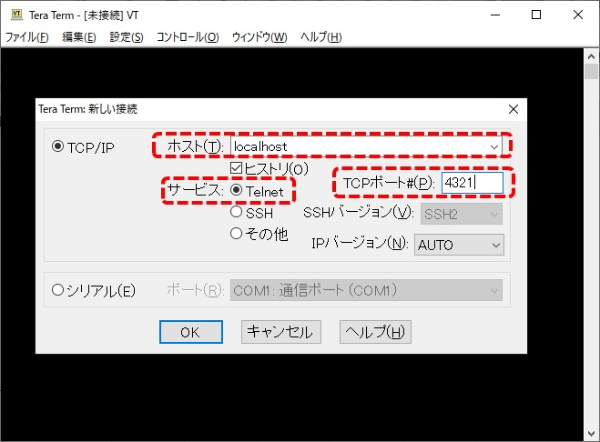

========================================
UARTを使ったシリアルデバッグ機能の使い方
========================================

:使用UARTチャネル: USART3(0x40004800)

.. ハイパーリンク定義
.. _TOPPERSプロジェクト: https://www.toppers.jp/asp3-e-download.html
.. _Linuxを始めよう: http://blog.livedoor.jp/hiroumauma/archives/1676244.html

今回のSTM32F746ZGを想定したエミュレータではUARTチャンネルを8ch設けています
ここでは、その中のUSART3を用いて評価用のシリアルデバッグ(いわゆるprinft)機能の使い方を説明します。
なお、サンプルプログラムに実装したテスト用printf関数について、`TOPPERSプロジェクト`_ 、および `Linuxを始めよう`_  のサンプルコードを参考にしました。

QEMUのUARTを介して内外部のターミナルに出力する仕組み
====================================================
QEMUにはchardev(キャラクタデバイス)という機能が設けられており、これをエミュレータ作成時に必要なデバイスへ割り当てることで、
外部へのデータ出力機能を持たせています。chardevそのものは関数 serial_hd(int i)で呼び出し、これを
各デバイスに割り当てています。

各エミュレータにおけるchardevの割り当て
---------------------------------------
STM32F746エミュレータでの割り当て方法は以下のようになっています。

::

   USART部へのchardev割り当て(QEMU/hw/arm/stm32f746_soc.c)
   for (i = 0; i < STM_NUM_USARTS; i++) {
        dev = DEVICE(&(s->usart[i]));　/* 各チャネルのデバイスを呼び出し */
        qdev_prop_set_chr(dev, "chardev", serial_hd(i)); /* chardevと紐付け */
        :
        以下省略
   }

デバイス側でのchardev使用部分
-----------------------------
chardevが割り当てられたデバイス側では、それをどのように使用するかを設定します。
今回のUSART3では送信レジスタ(TDR)へライトされたデータを出力するようにしました。
なお、ハードウェア仕様にならって送信中やビジーを表現する各種ステータスレジスタがある場合は都度設定が必要です。

::

   USART側のchardevへデータを出力する部分(QEMU/hw/char/stm32f746_uart.c)
   case USART_TDR:
        if (value < 0xF000) {
            /* ライトデータの受け取り*/
            ch = value;
            /* 割り当てられたchardev(&s->chr)へ専用APIで出力 */
            qemu_chr_fe_write_all(&s->chr, &ch, 1);
            /* ステータスレジスタを"送信完了"にする */
            s->usart_isr |= USART_SR_TC;
        }

外部ターミナル及びコンソールへの表示設定
========================================
準備したchardev出力を利用するためのコンソールおよびターミナルの設定を見ていきます。

QEMUコンソールの場合
--------------------
QEMUを起動すると以下のようなコンソール画面が立ち上がってきます。ここでViewメニューを参照すると、"compatmonitor0"、"serial0"、
"parallel0"など、いくつか出力先を選ぶことができます。今回のシリアルデバッグの対象となるのは"seral0～"の部分です。

.. _Fig19:
.. figure:: fig19.jpg
   :scale: 70%
   :align: center

   :QEMUコンソール画面

さて、この"serial0～"部分ですが、前述のserialserial_hd(int i)と紐ついていて、serialserial_hd(0)がserial0、
serialserial_hd(1)がserial1のようになっています。STM32F746マイコンにおいては以下のようになります。

.. list-table:: serial_hd(ch)とUART(ch)の対応
   :header-rows: 1
   
   * - serial_ch
     - USART_ch
     - 備考
   * - serial0
     - USART1
     -
   * - serial1
     - USART2
     -
   * - serial2
     - USART3
     - シリアルデバッガとして使用
   * - :
     - :
     -
   * - serial8
     - UART8
     -

というわけでQEMUでUSART3を出力するには、serial2を表示する必要があります。これを実現するために、QEMUの実行コマンド
に"-serial"設定を追加します。

.. code-block:: python
  
   QEMU起動コマンドに "-serial vc"を追加
   ./qemu-system-arm -S -gdb tcp::1234 -M nucleo-stm32-f746 -serial vc -serial vc -serial vc
   -kernel /c/ワークスペースのパス/Debug/nucleo-stm32f746.elf

コマンド中に"-serial vc"が3セット含まれています。これは"serial0"、"serial1"、"serial2"をQEMUのViewメニューに表示するためです。
以下にserialコマンドの数を変えた場合にQEMUコンソールを示します。

.. _Fig18:
.. figure:: fig18.jpg
   :scale: 50%
   :align: center

   :serialコマンド数とViewメニュー中のseiral(ch)の対応

serial2を表示した状態でサンプルプログラムを実行すると、デバッグ表示が確認できます。

.. _Fig20:

   :デバッグ出力の確認

MSYS2に出力する場合
-------------------
QEMUを実行しているMSYS2に出力する場合はserial2のところのコマンドを以下のようにします。

.. code-block:: python
  
   "-serial vc"を"-serial mon:stdio"に変更
   ./qemu-system-arm -S -gdb tcp::1234 -M nucleo-stm32-f746 -serial vc -serial vc -serial mon:stdio
   -kernel /c/ワークスペースのパス/Debug/nucleo-stm32f746.elf

こうすると、QEMU側のコンソールから"seiral2"が消えて、MSYS2側のターミナルにデバッグ出力されます。

.. _Fig21:

   :MSYS2側にデバッグ出力

teratermに出力する場合
----------------------
teratermに出力する場合は "-serial"コマンドにtelnetオプションを追加してポート番号を指定します。
QEMUの起動コマンドは以下のようになります。

.. code-block:: python
  
   "-serial vc"を"-serial telnet:localhost:4321,server,nowait"に変更
   ./qemu-system-arm -S -gdb tcp::1234 -M nucleo-stm32-f746 -serial vc -serial vc -serial telnet:localhost:4321,server,nowait 
   -kernel /c/ワークスペースのパス/Debug/nucleo-stm32f746.elf

デバッガのポート番号を4321に設定したので、これをteraterm側から参照します。

.. _Fig22:

   :teraterm側の接続設定

サンプルプログラムを実行すると、teraterm側にデバッグ出力されます。

.. _Fig23:
.. figure:: fig23.jpg
   :scale: 70%
   :align: center

   :teratermでの出力確認

teratermだと、ログをリアルタイム保存する機能などもあるため何かと便利かもしれませんね。

以上、UART機能を利用したデバッグ機能の確認でした。
